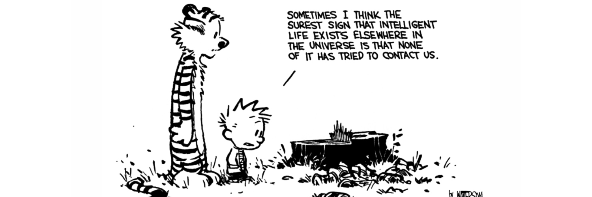

### Hi, I'm Suri :wave:

I'm a Web Developer / Experience Engineer based out of Chennai, TN. Java is my first language but I've been high on the JS ecosystem since forever :skull: I mostly work on React but I spend countless hours learning cool stuff and adapting to the latest tech out there.

While I'm not coding, you can find me raving about how beautiful :soccer: is. I'm a huge Chelsea fan and a sucker for cinema! I also play the guitar and sing.

Check out my recent project, Literature, a multiplayer card game - [LitAF](https://play-litaf.herokuapp.com)

> Design is not just what it looks like and feels like. Design is how it works.

<!--
**narayanasuri/narayanasuri** is a ✨ _special_ ✨ repository because its `README.md` (this file) appears on your GitHub profile.

Here are some ideas to get you started:

- 🔭 I’m currently working on ...
- 🌱 I’m currently learning ...
- 👯 I’m looking to collaborate on ...
- 🤔 I’m looking for help with ...
- 💬 Ask me about ...
- 📫 How to reach me: ...
- 😄 Pronouns: ...
- ⚡ Fun fact: ...
-->
